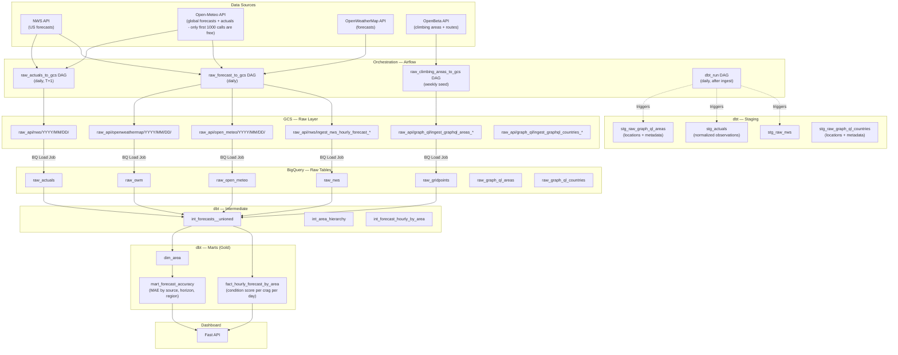

# Climbing Conditions

## Overview

A data pipeline and dashboard that answers "is Bishop climbable this weekend?", generating a conditon_score for each area and forecast based on temperature, precipitations, wind, and humidity levels. Rather than trusting a single forecast, there are multiple sources (NWS, open weather, etc.) and then eventually comparing against actual conditions. 

## Stack
- **Orchestration:** Airflow
- **Data Lake:** Google Cloud Storage 
- **Data Warehouse:** BigQuery 
- **Transformations:** dbt 
- **Dashboard:** FastAPI, ChartJS

---

## Diagram

---

## Phases

| Phase | Deliverable | Status
|---|---|---|
| 1 | Run airflow locally using docker, set up intiial DBT models for NWS data and create condition_score, learn more about FastAPI to begin setting up UI | DONE
| 2 | Updated models to be incremental (forecast and areas). Remove get_distinct_gridpoints from ingestion of NWS to reduce BQ calls. Ensure naming patterns are aligned, rename graph_ql to openbeta.  Refine Charts in UI to make them more useable. Enable DBT to run in airflow. Resolve any other TODOs in codebase. | IN-PROGESS
| 3 | Add unit tests for airflow. Add second source Open Weather API. | TODO
| 4 | Deploy Airflow to cloud so it's updated more regularly. Add source for actualy temperature, humidity readings to compare models to forecast. | TODO
| 5 | Deploy UI to cloud run and set up appropriately in Terraform. | TODO

Additional things to consider: 
- FastAPI is slow with BQ queriy: BQ is meant for analytics so there is a couple second latency with page loading. Caching helps but alternatives are better. Things to consider: BQ to DuckDB file (could use up a lot of memory), Redis and Firestore (potentially overkill)

---

## Estimated Monthly Cost

Locally, using docker airflow and BQ tables: 
| Service | Est. Cost |
|---|---|
| GCS storage + ops | ~$0.09 |
| BigQuery storage + queries | ~$0.04 |
| Airflow (local Astro CLI) | Free |
| **Total** | **~$0.13/month** |
